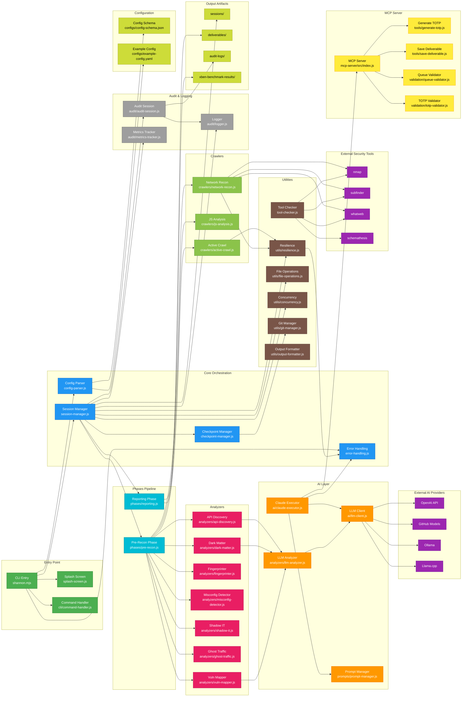

```mermaid

graph LR
    subgraph "Entry Point"
        CLI["CLI Entry<br/>shannon.mjs"]
        SplashScreen["Splash Screen<br/>splash-screen.js"]
        CommandHandler["Command Handler<br/>cli/command-handler.js"]
    end

    subgraph "Core Orchestration"
        SessionManager["Session Manager<br/>session-manager.js"]
        CheckpointManager["Checkpoint Manager<br/>checkpoint-manager.js"]
        ConfigParser["Config Parser<br/>config-parser.js"]
        ErrorHandling["Error Handling<br/>error-handling.js"]
    end

    subgraph "AI Layer"
        ClaudeExecutor["Claude Executor<br/>ai/claude-executor.js"]
        LLMClient["LLM Client<br/>ai/llm-client.js"]
        LLMAnalyzer["LLM Analyzer<br/>analyzers/llm-analyzer.js"]
        PromptManager["Prompt Manager<br/>prompts/prompt-manager.js"]
    end

    subgraph "External AI Providers"
        OpenAI["OpenAI API"]
        GitHubModels["GitHub Models"]
        Ollama["Ollama"]
        LlamaCPP["Llama.cpp"]
    end

    subgraph "Phases Pipeline"
        PreRecon["Pre-Recon Phase<br/>phases/pre-recon.js"]
        Reporting["Reporting Phase<br/>phases/reporting.js"]
    end

    subgraph "Crawlers"
        ActiveCrawl["Active Crawl<br/>crawlers/active-crawl.js"]
        JSAnalysis["JS Analysis<br/>crawlers/js-analysis.js"]
        NetworkRecon["Network Recon<br/>crawlers/network-recon.js"]
    end

    subgraph "Analyzers"
        APIDiscovery["API Discovery<br/>analyzers/api-discovery.js"]
        DarkMatter["Dark Matter<br/>analyzers/dark-matter.js"]
        Fingerprinter["Fingerprinter<br/>analyzers/fingerprinter.js"]
        MisconfigDetector["Misconfig Detector<br/>analyzers/misconfig-detector.js"]
        ShadowIT["Shadow IT<br/>analyzers/shadow-it.js"]
        GhostTraffic["Ghost Traffic<br/>analyzers/ghost-traffic.js"]
        VulnMapper["Vuln Mapper<br/>analyzers/vuln-mapper.js"]
    end

    subgraph "External Security Tools"
        Nmap["nmap"]
        Subfinder["subfinder"]
        Whatweb["whatweb"]
        Schemathesis["schemathesis"]
    end

    subgraph "MCP Server"
        MCPIndex["MCP Server<br/>mcp-server/src/index.js"]
        GenerateTOTP["Generate TOTP<br/>tools/generate-totp.js"]
        SaveDeliverable["Save Deliverable<br/>tools/save-deliverable.js"]
        QueueValidator["Queue Validator<br/>validation/queue-validator.js"]
        TOTPValidator["TOTP Validator<br/>validation/totp-validator.js"]
    end

    subgraph "Utilities"
        ToolChecker["Tool Checker<br/>tool-checker.js"]
        Resilience["Resilience<br/>utils/resilience.js"]
        FileOperations["File Operations<br/>utils/file-operations.js"]
        Concurrency["Concurrency<br/>utils/concurrency.js"]
        GitManager["Git Manager<br/>utils/git-manager.js"]
        OutputFormatter["Output Formatter<br/>utils/output-formatter.js"]
    end

    subgraph "Audit & Logging"
        AuditSession["Audit Session<br/>audit/audit-session.js"]
        Logger["Logger<br/>audit/logger.js"]
        MetricsTracker["Metrics Tracker<br/>audit/metrics-tracker.js"]
    end

    subgraph "Configuration"
        ConfigSchema["Config Schema<br/>configs/config-schema.json"]
        ExampleConfig["Example Config<br/>configs/example-config.yaml"]
    end

    subgraph "Output Artifacts"
        Sessions["sessions/"]
        Deliverables["deliverables/"]
        AuditLogs["audit-logs/"]
        BenchmarkResults["xben-benchmark-results/"]
    end

    %% Entry Point Flow
    CLI --> SplashScreen
    CLI --> CommandHandler
    CLI --> ConfigParser
    CLI --> SessionManager

    %% Core Orchestration
    SessionManager --> CheckpointManager
    SessionManager --> AuditSession
    ConfigParser --> ConfigSchema
    ConfigParser --> ExampleConfig

    %% Phase Execution
    SessionManager --> PreRecon
    SessionManager --> Reporting
    CheckpointManager --> GitManager

    %% AI Layer Connections
    ClaudeExecutor --> LLMClient
    ClaudeExecutor --> PromptManager
    LLMAnalyzer --> LLMClient
    LLMClient --> OpenAI
    LLMClient --> GitHubModels
    LLMClient --> Ollama
    LLMClient --> LlamaCPP

    %% Crawlers to Phases
    PreRecon --> ActiveCrawl
    PreRecon --> JSAnalysis
    PreRecon --> NetworkRecon

    %% Network Recon to External Tools
    NetworkRecon --> Nmap
    NetworkRecon --> Subfinder
    NetworkRecon --> Whatweb
    ToolChecker --> Nmap
    ToolChecker --> Subfinder
    ToolChecker --> Whatweb
    ToolChecker --> Schemathesis

    %% Analyzers
    PreRecon --> APIDiscovery
    PreRecon --> DarkMatter
    PreRecon --> Fingerprinter
    PreRecon --> MisconfigDetector
    PreRecon --> ShadowIT
    PreRecon --> GhostTraffic
    PreRecon --> VulnMapper

    %% Analyzers use AI
    APIDiscovery --> LLMAnalyzer
    DarkMatter --> LLMAnalyzer
    VulnMapper --> LLMAnalyzer

    %% MCP Server
    MCPIndex --> GenerateTOTP
    MCPIndex --> SaveDeliverable
    MCPIndex --> QueueValidator
    MCPIndex --> TOTPValidator
    ClaudeExecutor --> MCPIndex

    %% Utilities
    SessionManager --> Resilience
    SessionManager --> FileOperations
    SessionManager --> Concurrency
    ActiveCrawl --> Resilience
    NetworkRecon --> Resilience

    %% Logging & Audit
    SessionManager --> Logger
    SessionManager --> MetricsTracker
    AuditSession --> Logger

    %% Output Artifacts
    SessionManager --> Sessions
    Reporting --> Deliverables
    AuditSession --> AuditLogs
    Reporting --> BenchmarkResults

    %% Error Handling
    CLI --> ErrorHandling
    ClaudeExecutor --> ErrorHandling
    Resilience --> ErrorHandling

    %% Styling
    classDef entry fill:#4CAF50,stroke:#2E7D32,color:#fff
    classDef core fill:#2196F3,stroke:#1565C0,color:#fff
    classDef ai fill:#FF9800,stroke:#EF6C00,color:#fff
    classDef external fill:#9C27B0,stroke:#6A1B9A,color:#fff
    classDef phase fill:#00BCD4,stroke:#00838F,color:#fff
    classDef crawler fill:#8BC34A,stroke:#558B2F,color:#fff
    classDef analyzer fill:#E91E63,stroke:#AD1457,color:#fff
    classDef tool fill:#607D8B,stroke:#37474F,color:#fff
    classDef mcp fill:#FFEB3B,stroke:#F9A825,color:#000
    classDef util fill:#795548,stroke:#4E342E,color:#fff
    classDef audit fill:#9E9E9E,stroke:#616161,color:#fff
    classDef output fill:#CDDC39,stroke:#9E9D24,color:#000

    class CLI,SplashScreen,CommandHandler entry
    class SessionManager,CheckpointManager,ConfigParser,ErrorHandling core
    class ClaudeExecutor,LLMClient,LLMAnalyzer,PromptManager ai
    class OpenAI,GitHubModels,Ollama,LlamaCPP,Nmap,Subfinder,Whatweb,Schemathesis external
    class PreRecon,Reporting phase
    class ActiveCrawl,JSAnalysis,NetworkRecon crawler
    class APIDiscovery,DarkMatter,Fingerprinter,MisconfigDetector,ShadowIT,GhostTraffic,VulnMapper analyzer
    class MCPIndex,GenerateTOTP,SaveDeliverable,QueueValidator,TOTPValidator mcp
    class ToolChecker,Resilience,FileOperations,Concurrency,GitManager,OutputFormatter util
    class AuditSession,Logger,MetricsTracker audit
    class Sessions,Deliverables,AuditLogs,BenchmarkResults,ConfigSchema,ExampleConfig output

```