> [!NOTE]
> **This is Shannon Uncontained — a fork of [KeygraphHQ/shannon](https://github.com/KeygraphHQ/shannon).**
> See [Fork Philosophy](#-fork-philosophy) for why this exists and how it differs.


<div align="center">

# Shannon Uncontained

### *The AI Pentester, Liberated from Its Container*

Shannon's purpose is refreshingly simple: break your web application before someone with less noble intentions does it for you. Consider it the Red Team to your vibe-coding Blue Team, the skeptic in a room full of optimists, the one asking "but have you actually *tried* to exploit this?" while everyone else admires the architecture.

---

[Original Project](https://github.com/KeygraphHQ/shannon) • [Discord](https://discord.gg/KAqzSHHpRt)

---

</div>

## 🍴 Fork Philosophy

> *"The struggle for a free intelligence has always been a struggle between the ironic and the literal mind."*

### Why "Uncontained"?

The upstream Shannon project is excellent software wrapped in unfortunate assumptions:

1. **That Docker is the natural habitat of Node.js applications** — It is not. Docker is a deployment strategy, not a prerequisite. Wrapping a JavaScript runtime in a Linux userspace to achieve "portability" is solving a problem that `npm install` solved decades ago.

2. **That source code is always available** — A charming assumption for internal security teams, but the real world contains applications whose source you cannot access, must not access, or have simply lost.

3. **That one LLM provider rules them all** — Claude is excellent. So is GPT-4. So is Gemini. A tool that demands vendor loyalty is a tool with an expiration date.

This fork addresses these assumptions. We call it "Uncontained" because:
- It runs *outside* containers by default
- It handles *uncontained* scope (black-box testing)
- It remains *uncontained* by vendor lock-in

### What This Fork Adds

| Capability | Upstream Shannon | Shannon Uncontained |
|:-----------|:---------------:|:-------------------:|
| Native execution | Via Docker | **Direct** |
| Black-box reconnaissance | ❌ | **✅** |
| Multi-provider LLM | Claude only | **Claude, OpenAI, GitHub Models, Ollama, llama.cpp, LM Studio** |
| Local source generation | ❌ | **✅** |
| Synthetic pseudo-source | ❌ | **✅** |
| Advanced analyzers | ❌ | **✅ (9 specialized modules)** |
| LLM-powered inference | ❌ | **✅** |
| CI/CD integration | ❌ | **✅ (GitHub Actions)** |
| SARIF reporting | ❌ | **✅** |
| OWASP Top 10 mapping | ❌ | **✅** |

### What This Fork Does *Not* Change

The core architecture remains identical. The exploitation methodology is unchanged. The agents, the prompts, the parallel processing — all inherited from upstream. We are not rewriting Shannon; we are *extending* it.

**This is not a hostile fork.** It is a divergent one. The upstream maintainers have built something genuinely useful, and this fork exists to push it in directions they may not prioritize. If any of these features prove valuable, we would be delighted to see them merged upstream.

---

## 🎯 What is Shannon?

Shannon is an AI pentester that delivers actual exploits, not just alerts.

While lesser tools content themselves with generating alarming JSON files full of theoretical vulnerabilities, Shannon does the intellectually honest thing: it *attacks your application* and shows you the receipts. If it can't exploit a vulnerability, it doesn't report it. This is not timidity — it is rigor.

**The Problem Shannon Addresses:**

Your team ships code continuously. Your penetration test happens annually, if you're lucky. This creates what we might charitably call a "security gap" — though "yawning chasm of organizational denial" is more accurate. For 364 days a year, you're shipping code that no adversarial intelligence has examined.

Shannon closes this gap by acting as your on-demand pentester. It doesn't merely *identify* issues; it *exploits* them, providing evidence that even the most determined skeptic cannot dismiss.

---

## 🚀 Setup & Usage

### Prerequisites

- **Node.js 18+** — the runtime, not a container pretending to contain a runtime
- **API credentials** — Claude, OpenAI, GitHub Models, or run locally with Ollama/llama.cpp/LM Studio (see `.env.example`)
- **Optional reconnaissance tools** — `nmap`, `subfinder`, `whatweb`, `gau`, `katana`

### Installation

```bash
# Clone the repository
git clone https://github.com/Steake/shannon.git
cd shannon

# Install dependencies
npm install

# Configure your environment
cp .env.example .env
# Edit .env with your API credentials

# Install Playwright browsers (for JavaScript-rendered applications)
npx playwright install chromium
```

### Running Shannon

**White-box mode (with source code):**

```bash
./shannon.mjs "https://your-app.com/" "./path/to/source"
```

**Black-box mode (without source code):**

```bash
# Generate synthetic source from reconnaissance
node local-source-generator.mjs --target "https://your-app.com" --output "./synthetic-source"

# Run Shannon against the synthetic source
./shannon.mjs "https://your-app.com/" "./synthetic-source"
```

### Configuration

Create a YAML configuration file for authenticated testing:

```yaml
authentication:
  login_type: form
  login_url: "https://your-app.com/login"
  credentials:
    username: "test@example.com"
    password: "yourpassword"
    totp_secret: "LB2E2RX7XFHSTGCK"  # Optional for 2FA

  login_flow:
    - "Type $username into the email field"
    - "Type $password into the password field"
    - "Click the 'Sign In' button"

  success_condition:
    type: url_contains
    value: "/dashboard"
```

### CI/CD Integration

Shannon can be integrated into your automated pipeline using GitHub Actions:

```yaml
name: Security Scan
on: [push, pull_request]

jobs:
  shannon-scan:
    # If you've forked and modified the workflow, update the repository path
    uses: Steake/shannon-uncontained/.github/workflows/shannon-scan.yml@main
    with:
      target: "https://staging.your-app.com"
      black-box: true
    secrets:
      GITHUB_TOKEN: ${{ secrets.GITHUB_TOKEN }}
```

The workflow automatically:
- Installs Shannon and required tools
- Runs reconnaissance and exploitation
- Generates SARIF reports for GitHub Security tab
- Uploads findings as workflow artifacts
- Creates markdown summaries in PR comments

See `.github/workflows/shannon-scan.yml` for the full reusable workflow.

---

## ✨ Features

### Core Capabilities

- **Fully Autonomous Operation** — Launch with a single command. The AI handles reconnaissance, exploitation, and reporting without intervention.

- **Proof-of-Concept or It Didn't Happen** — Every reported vulnerability comes with a reproducible exploit. No theoretical hand-wraving.

- **Multi-Provider LLM Support** — Claude, OpenAI, GitHub Models, Ollama, llama.cpp, LM Studio. Vendor lock-in is for those who've stopped thinking.

- **Black-Box Reconnaissance** — The Local Source Generator creates synthetic source from crawled endpoints when real source isn't available.

- **Parallel Processing** — Analysis and exploitation run concurrently across vulnerability categories.

### Advanced Reconnaissance *(Phase 3: The Interesting Bits)*

Shannon Uncontained includes specialized analyzers that find what conventional scanners miss:

- **API Discovery** — Harvests OpenAPI/Swagger specs, GraphQL introspection, and API endpoints buried in JavaScript bundles. Generates `schemathesis` configs for automated API fuzzing.

- **Technology Fingerprinting** — Identifies frameworks, CMSs, WAFs, and CDNs through enhanced `whatweb` integration and behavioral analysis. Knows what you're running before you remember deploying it.

- **Shadow IT Hunter** — Discovers forgotten infrastructure, dev/staging environments, misconfigured S3 buckets in client-side code, and Git leakage (`.git` folder reconstruction). Finds what your org forgot they deployed.

- **Dark Matter Analysis** — Detects hidden endpoints in comments, obfuscated code patterns, WebSocket connections, and classic forgotten directories (`/admin`, `/backup`, `/staging`). The invisible made visible.

- **Ghost Traffic Generation** — Replays sanitized traffic patterns, performs adversarial fuzzing, simulates race conditions, and mimics legitimate user behavior to uncover timing-based vulnerabilities.

- **Misconfig Detector ("They Did It Wrong")** — Finds developer mistakes across multiple categories:
  - **Debug features**: Debug flags (`?debug=true`, `?admin=1`), CSS-hidden admin panels (`display:none` as security)
  - **Hardcoded secrets**: AWS keys, GitHub tokens, JWT secrets, API keys, passwords, connection strings
  - **Development artifacts**: Hardcoded `localhost` in production bundles, build path leaks (`/Users/dev/...`)
  - **Security misconfigs**: CORS set to `*`, leaked TODOs/FIXMEs with security implications

- **Vulnerability Mapper** — Maps discovered endpoints to OWASP vulnerability classes, identifies input vectors (query params, forms, headers), generates synthetic sources for data flow analysis, and creates hypothesis queues for exploitation.

- **LLM-Powered Analysis** — Uses AI to infer architecture from crawled data, generate data flow models, identify API patterns (REST/GraphQL), and detect authentication flows. Intelligence compensating for lack of information.

### Enterprise Features *(Phase 4: The Boring But Necessary Bits)*

- **CI/CD Integration** — GitHub Actions workflow template for automated security scanning in your pipeline. Includes artifact upload and SARIF report generation for GitHub Security tab integration.

- **Multi-Format Reporting** — JSON for robots, HTML for humans who pretend to read them, SARIF for compliance automation. Choose your format based on who's asking.

- **OWASP Top 10 Mapping** — All findings mapped to OWASP Top 10 2021 categories for audit and compliance requirements.

- **Audit Trail** — Comprehensive evidence logging with timestamps and metadata. CYA documentation that actually documents something.

---

## 🏗️ Architecture

Shannon emulates a human penetration tester's methodology through a multi-agent architecture. This fork extends the pipeline with black-box reconnaissance capabilities:

```mermaid
flowchart TB
    subgraph FORK["🔓 SHANNON UNCONTAINED"]
        direction TB
        
        subgraph Input["Input Selection"]
            direction LR
            SRC["📁 Source Code<br/>(White-box)"]
            URL["🌐 Target URL<br/>(Black-box)"]
        end
        
        subgraph LSG["Local Source Generator"]
            direction TB
            RECON["🔍 External Recon<br/>gau, katana, nmap"]
            CRAWL["🕷️ Active Crawling<br/>Playwright, JS Analysis"]
            SYNTH["🏭 Pseudo-Source<br/>Builder"]
            RECON --> CRAWL --> SYNTH
        end
        
        subgraph LLM["Multi-Provider LLM"]
            direction LR
            CLAUDE["Claude"]
            GPT["OpenAI"]
            GITHUB["GitHub<br/>Models"]
        end
    end
    
    subgraph ORIG["📦 OG SHANNON"]
        direction TB
        
        subgraph Phase1["Phase 1: Pre-Reconnaissance"]
            PREC[("🗺️ Code Analysis<br/>& Mapping")]
        end
        
        subgraph Phase2["Phase 2: Vulnerability Analysis"]
            direction LR
            VA1["Injection"]
            VA2["XSS"]
            VA3["Auth/AuthZ"]
            VA4["SSRF"]
        end
        
        subgraph Phase3["Phase 3: Exploitation"]
            direction LR
            E1["💉 Inject"]
            E2["📜 XSS"]
            E3["🔐 Auth"]
            E4["🌐 SSRF"]
        end
        
        subgraph Phase4["Phase 4: Reporting"]
            REP[("📋 Validated<br/>Findings Only")]
        end
        
        Phase1 --> VA1 & VA2 & VA3 & VA4
        VA1 --> E1
        VA2 --> E2
        VA3 --> E3
        VA4 --> E4
        E1 & E2 & E3 & E4 --> REP
    end
    
    SRC --> Phase1
    URL --> LSG
    LSG --> |"Synthetic Source"| Phase1
    CLAUDE & GPT & GITHUB -.-> |"Powers All Agents"| Phase1
    
    style FORK fill:#1a2f1a,stroke:#4a4,stroke-width:3px,color:#8f8
    style ORIG fill:#1a1a2f,stroke:#66f,stroke-width:3px,color:#aaf
    style LSG fill:#2d5a27,stroke:#4a4,color:#fff
    style LLM fill:#1a3a5c,stroke:#48f,color:#fff
```



**Legend:**
- 🟢 **Green border** — Fork additions (black-box recon, multi-provider LLM)
- 🔵 **Blue border** — Original Shannon architecture (unchanged)

### Phase Descriptions

#### 🟢 Pre-Phase: Input Selection & Source Generation *(Fork Addition)*

Before the original Shannon pipeline begins, this fork adds a critical decision point:

- **White-box path**: If source code is available, proceed directly to Phase 1
- **Black-box path**: If only a URL is available, invoke the **Local Source Generator**:
  1. **External Reconnaissance** — `gau` harvests historical URLs, `katana` actively crawls, `nmap`/`subfinder`/`whatweb` fingerprint the target
  2. **Active Crawling** — Playwright renders JavaScript, extracts links/forms, analyzes client-side code
  3. **Pseudo-Source Builder** — Generates synthetic route files, models, and configs that downstream agents can analyze

#### 🟢 LLM Provider Selection *(Fork Addition)*

All agents are powered by your choice of LLM provider:
- **Claude** (Anthropic) — Original provider, excellent for code analysis
- **OpenAI** (GPT-4) — Alternative with different strengths
- **GitHub Models** — Free tier access to various models
- **Ollama** — Local models without API costs
- **llama.cpp** — Native local inference
- **LM Studio** — GUI-based local model hosting

Configure via `GITHUB_TOKEN`, `ANTHROPIC_API_KEY`, `OPENAI_API_KEY`, or `LLM_PROVIDER` environment variables. See `.env.example` for all options.

#### 🔵 Phase 1: Pre-Reconnaissance

Map the attack surface through source analysis (real or synthetic) and live exploration. The agent builds a comprehensive understanding of:
- Application architecture and entry points
- API endpoints and parameters
- Authentication mechanisms and session handling
- Technology stack and framework-specific patterns

#### 🔵 Phase 2: Vulnerability Analysis

Parallel agents hunt for flaws across four OWASP categories simultaneously:
- **Injection** — SQL, NoSQL, command injection vectors
- **XSS** — Reflected, stored, DOM-based cross-site scripting
- **Auth/AuthZ** — Broken authentication and authorization flaws
- **SSRF** — Server-side request forgery opportunities

Each agent traces user input from sources to dangerous sinks, building exploitation hypotheses.

#### 🔵 Phase 3: Exploitation

Hypotheses become proofs. Dedicated exploit agents attempt real attacks:
- Browser automation for client-side exploits
- Direct HTTP requests for injection attacks
- Session manipulation for auth bypass

**No exploit, no report.** If a vulnerability cannot be demonstrated, it is not reported.

#### 🔵 Phase 4: Reporting

Validated findings compiled into actionable reports with:
- Reproducible proof-of-concept code
- Step-by-step exploitation instructions
- Severity assessment and remediation guidance
- Multiple output formats: JSON (machine-readable), HTML (human-readable with dark theme), SARIF (GitHub Security integration)
- OWASP Top 10 2021 mapping for compliance
- Comprehensive audit trail with timestamps

### Analyzer Modules *(Fork Addition)*

The Local Source Generator includes nine specialized analyzers for comprehensive black-box reconnaissance:

| Analyzer | Purpose | Key Capabilities |
|:---------|:--------|:-----------------|
| **API Discovery** | Find and document APIs | OpenAPI/Swagger detection, GraphQL introspection, endpoint extraction from JS bundles, `schemathesis` config generation |
| **Fingerprinter** | Identify technology stack | Framework detection (React, Angular, Vue, Rails, Django), CMS identification (WordPress, Drupal), WAF/CDN detection (Cloudflare, Akamai), version enumeration |
| **Shadow IT** | Discover forgotten infrastructure | Cloud asset correlation (AWS, Azure, GCP), dev/staging environment detection, S3 bucket identification, Git leakage scanning |
| **Dark Matter** | Find hidden endpoints | Comment-based discovery, obfuscated code patterns, WebSocket identification, hidden directory scanning (`/admin`, `/backup`, etc.) |
| **Ghost Traffic** | Generate synthetic requests | Traffic pattern replay, adversarial fuzzing, race condition simulation, behavioral user mimicry |
| **Misconfig Detector** | Find developer mistakes | Debug flag detection (`?debug=true`), CSS-hidden features (`display:none`), hardcoded secrets (AWS keys, GitHub tokens, passwords), CORS misconfigurations, leaked TODOs/FIXMEs |
| **Vuln Mapper** | Map vulnerabilities | OWASP class mapping, input vector identification, source-to-sink inference, exploit hypothesis generation |
| **LLM Analyzer** | AI-powered inference | Architecture inference from behavior, data flow modeling, API pattern recognition, authentication flow detection |
| **Network Recon** | Infrastructure discovery | Port scanning (`nmap`), subdomain enumeration (`subfinder`), service fingerprinting (`whatweb`) |

All analyzers include:
- Graceful degradation when tools are unavailable
- Timeout handling for network operations
- Structured JSON output for downstream processing
- Comprehensive test coverage

---

## 📊 Sample Reports & Benchmarks

Shannon's capabilities demonstrated on industry-standard vulnerable applications:

| Target | Vulnerabilities Found | Key Achievements |
|:-------|:---------------------:|:-----------------|
| **[OWASP Juice Shop](sample-reports/shannon-report-juice-shop.md)** | 20+ | Complete auth bypass, database exfiltration |
| **[c{api}tal API](sample-reports/shannon-report-capital-api.md)** | 15 | Root-level injection, privilege escalation |
| **[OWASP crAPI](sample-reports/shannon-report-crapi.md)** | 15+ | JWT attacks, full database compromise |

---

## 📋 Fork-Specific Documentation

| Document | Purpose |
|:---------|:--------|
| **[LSG-TODO.md](./LSG-TODO.md)** | Local Source Generator roadmap |
| **[MODS.md](./MODS.md)** | Modifications log for this fork |
| **[COVERAGE.md](./COVERAGE.md)** | Security testing coverage |
| **[SHANNON-PRO.md](./SHANNON-PRO.md)** | Pro vs Lite comparison (upstream) |

---

## ⚠️ Disclaimers

### This Is Not a Passive Scanner

Shannon actively exploits vulnerabilities to prove they exist. This has consequences.

> [!WARNING]
> **Do not run Shannon on production environments.**
>
> It will create users. It will modify data. It will execute injection attacks. This is not a bug; it is the point. Use staging or development environments exclusively.

### Legal & Ethical Use

> [!CAUTION]
> **You must have explicit, written authorization** from the system owner before running Shannon.
>
> Unauthorized security testing is illegal under laws like the Computer Fraud and Abuse Act. We are not responsible for your poor decisions.

### LLM Limitations

The underlying models can hallucinate. Human verification of findings remains essential. Trust, but verify.

### Fork Status

> [!IMPORTANT]
> **This is an independent fork, not an official Keygraph product.**
>
> For enterprise features, Shannon Pro, or commercial support, contact the [original maintainers](https://github.com/KeygraphHQ/shannon).

---

## 📜 A Note to the Shannon Maintainers

This fork exists in the spirit of open source: taking good software and making it work in contexts the original authors didn't prioritize. We have:

- Preserved all copyright notices and license terms
- Maintained attribution throughout
- Not misrepresented this as official Keygraph software
- Made our modifications explicit and documented

We would be genuinely pleased if any of these features — particularly the multi-provider LLM support and black-box reconnaissance — proved useful enough to merge upstream. Consider this a feature branch that happened to take a scenic route.

If you object to anything here, we're happy to discuss. If you'd like to collaborate, even better.

In the meantime, we'll be over here, running pentests without Docker.

*— The Uncontained*

---

## 📜 License

Shannon Lite is released under the [GNU Affero General Public License v3.0 (AGPL-3.0)](LICENSE).

Use it freely. Modify it privately. If you offer it as a service, share your modifications. The license exists to keep honest people honest — and this fork honors that principle.

---

## 👥 Community & Support

- 🐛 **Report bugs** via [GitHub Issues](https://github.com/Steake/shannon/issues)
- 💡 **Suggest features** in [Discussions](https://github.com/Steake/shannon/discussions)
- 💬 **Discord**: [Join the conversation](https://discord.gg/KAqzSHHpRt)

---

<p align="center">
  <b>Shannon Uncontained</b><br>
  <i>Because some applications need to be broken before they can be fixed — and some tools need to escape their containers to do it.</i>
</p>
